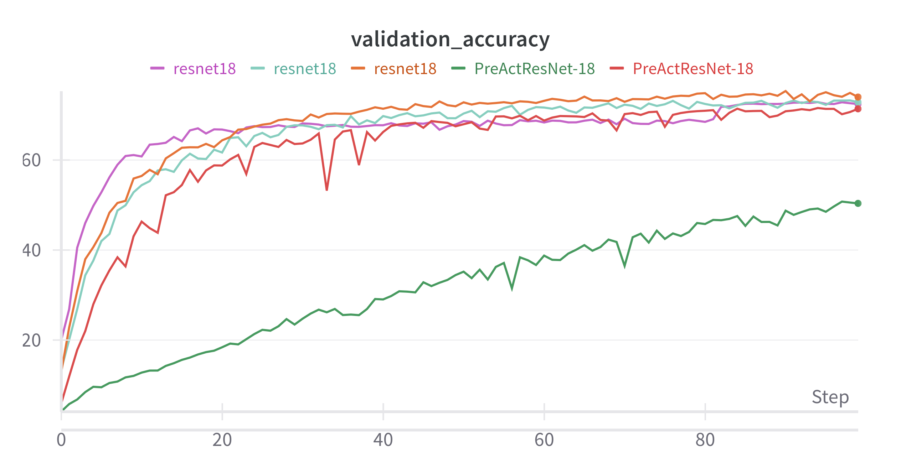
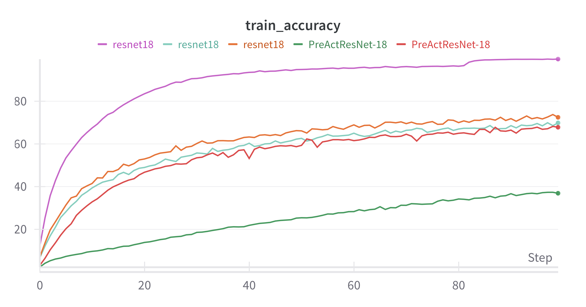

Wandb Dashboard: https://wandb.ai/vladimir-anfimov-alexandru-ioan-cuza/advanced-neural-networks-hw3

# 1. During sweeps I had the following variations:
    1.1. Models
        1.1.1. ResNet18, but with some modifications to make it work with the CIFAR-100 dataset, namely the first convolutional layer has a kernel size of 3 and the stride of 1, also the max pooling was replaced by the identity function in order to minimize the loss of information.
        This is because ResNet18 was initially designed for the ImageNet dataset, which has images of 224x224 pixels, while CIFAR-100 has images of 32x32 pixels.
        1.1.2. PreActResNet-18
    1.2. Optimizers
        1.2.1. SGD
        1.2.2. AdamW
    1.3. Transfomations
        1.3.1. RandomHorizontalFlip
        1.3.2. RandomCrop
        1.3.3. RandomRotation
        1.3.4. ColorJitter
        1.3.5. RandomErasing
    1.4. Data Augmentation
        1.4.1. Cutout
        1.4.2. Mixup

# Results
For all the models I have used the following hyperparameters:
- Epochs: 100
- Batch Size: 64
- Learning Rate: 0.001
- Scheduler: ReduceLROnPlateau

| #  | Model           | Optimizer |  Data Augmentations                                  | Training Accuracy | Test Accuracy |
|----|----------------|-----------|-----------------------------------------------------| ----------------- | ------------- |
| 1  | PreActResNet-18 | SGD       | RandomCrop, RandomHorizontalFlip, ColorJitter, RandomErasing, CutMix, MixUp | 36.82%  | 50.33% |
| 3  | resnet18       | AdamW     | RandomCrop, RandomHorizontalFlip, ColorJitter, RandomErasing | 99.69%    | 72.40% |
| 4  | resnet18       | AdamW     | RandomCrop, RandomHorizontalFlip, RandomRotation, ColorJitter, RandomErasing | 69.80% | 72.82% |
| 5  | resnet18       | AdamW     | RandomCrop, RandomHorizontalFlip, ColorJitter, RandomErasing, CutMix, MixUp | 72.39% | 73.95% (best 75.02%) |

